# superacan-emu

Super A'Can（敦煌科技 Funtech，1995，台灣自製 16 位元遊戲機）的硬體模擬器，
原始碼公開（source-available，非商業免費，見「授權」）。
production 主線正改以純 Go 重寫 68000／65C02、UMC6650、UM6618、UM6619、DMA、
輸入與整機時間線，Ebitengine 將負責跨平台前端；遊戲只用來驗證晶片行為，這不是
遊戲 remake。

Bcan 0.0.8b 是閉源 Windows 模擬器且沒有公開移植。本專案依據唯讀知識庫
[superacan](https://github.com/wicanr2/superacan) 的 Bcan／BIOS 逆向證據，以及 MAME
driver（BSD-3-Clause）的硬體行為參考，建立獨立、可攜的純 Go 實作。

長期目標：以可追溯、可重現的晶片模型在 Linux 執行 Super A'Can 軟體，並在核心
收斂後提供 macOS 版本。模擬器原始碼同時是硬體文件；相容性不能取代硬體證據。

## 目前進度（純 Go 轉向）

2026-08-31 已決定停止 C++ production path。現有可執行 C++ 里程碑將保存在同 repo
的 `archive/cpp/`，標為 deprecated reference implementation，作 Go 差分 oracle，
不再新增功能。Go 68000 核心採獨立實作；Moira 只作 sample，不直接翻譯。

Go 主線已有完整整機 bus、雙 CPU 排程、UMC6650、UM6618、UMC6619、主機 DMA、IRQ、
P1 輸入、headless runner 與 Ebitengine v2.9.9 前端。Speedy Dragon、Formosa Duel 與
Boom Zoo 均已在純 Go machine core 連續執行 1200 frames，產生可辨識畫面與非零音訊；
核心沒有遊戲專屬 opcode stub。Ebitengine 已接上 P1 鍵盤、320×240 framebuffer、48 kHz
主機音訊與有界截圖 smoke；三款 ROM 的 1200-frame GUI 路徑均已由 Xvfb 驗證，結果
與 headless machine core 基準一致。
完整 68000／W65C02 ISA、所有未使用硬體模式、實機音訊與跨平台發行仍是相容性工作，
不能因三款 ROM 通過就宣稱硬體覆蓋完整。
下列完整相容性仍是
deprecated C++ oracle 的舊里程碑，不是 Go 版完成度：

- [x] 68k（Moira）+ 匯流排記憶體映射（依知識庫 `docs/memory-map.md` §2 (a) 級定案）
- [x] UMC6650 lockout 晶片完整實作（埠角色以 IPL 反組譯為準，見
      `docs/bios-68k.md` §3；**MAME `umc6650.cpp` 的埠角色寫反，本實作不沿用**）
- [x] 68k IPL overlay（`$E9001C` bit1/bit3，**單向 latch**，見 `docs/verify-video.md`）
- [x] UM6618 繪圖：3 tilemap 層（8/4/2bpp、scroll/mosaic/linescroll/lineselect/
      優先度混色）+ sprite（含 mask 模式）+ window 0 + sprite DMA；ROZ 暫 stub
- [x] 68k IRQ：vblank（IRQ7）、raster（IRQ4）、line on/off（IRQ5）、
      65C02 mailbox（IRQ6），HOLD_LINE 語意以 Moira `willInterrupt` 模擬
- [x] 主機 DMA 2 通道（byte/word/0xA800 填充/間接模式）
- [x] 65C02（CLK `6502Mk2`）實際執行：I/O `$0400-$04FF`、命令 mailbox、
      boot ack、HALT/釋放（重新上傳驅動；reset 拉住至向量讀取完成）
- [x] **UM6619 音效合成**：16 通道 PCM 取樣（period/音量/key/長度/起始位址）、
      DMA 雙緩衝（IRQ bit6）、內建 timer（IRQ bit7，音樂 tempo）；
      原生 44744 Hz → 線性插值 48000 Hz；SDL2 音訊輸出 + `--wav` headless 錄音
      （`src/audio/um6619.*`，見 `docs/verify-audio-input.md`）
- [x] 65C02 IRQ 來源模型：level-held + 專屬 ack（`$0411` 純狀態）；latch
      `$0404/$0405`（空=`$CD`、68k 寫入觸發 IRQ）
- [x] 手把輸入：SDL 鍵盤（方向鍵 + Z/X/A/S/Q/W = A/B/X/Y/L/R、Enter=Start、
      右 Shift=Select；P1）+ headless `--press frame:BTN,...` 注入；
      65C02 shift register 掃描與 68k direct mode 兩路皆通
- [x] SDL2 視窗輸出 + headless 驗證模式（`--frames`/`--screenshot`/`--wav`/`--press`）
- [x] 遊戲驗證：Boom Zoo、Monopoly（畫面+音樂+按鍵反應）、Speedy Dragon
      （**第二套音樂驅動已修復**，預設模式可跑；見 `docs/verify-audio-input.md`）
- [x] ROZ、P2 輸入與自訂 save state 初版；sprite DMA word 雙觸發已修正
      （見 `docs/verify-misc.md`）
- [ ] 里程碑 5 尚待乾淨 Docker 建置與跨遊戲回歸；FRC 真實公式、UM6619 envelope、
      latch 3-byte 用途與 window 1 仍未取得硬體級證據

詳細現況以 [`CONTEXT.md`](CONTEXT.md) 為準，可執行待辦只看
[`WORKLIST.md`](WORKLIST.md)。

## 展示影片

[下載展示影片](https://github.com/wicanr2/superacan-emu/releases/download/promo/superacan-emu-promo.mp4)
（113 秒、960×720、含聲音）——關於畫面、卡帶瀏覽器、Boom Zoo 實際遊玩，接著把覆蓋
選單底下的每個畫面走一遍：存檔槽的存與讀、金手指、設定的六個子畫面（輸入、熱鍵、
影像、音訊、語言、觸控）、診斷，最後換第二片卡帶。影片是用發行的 AppImage 錄的，
不是開發中的執行檔：輸入是腳本，同一份腳本在同一份 AppImage 上會錄出同一段影片。

影片放在 GitHub Release（tag `promo`）的附件而不是版控裡：二進位檔不做差分，
每重錄一次就會在 git 歷程多留一份完整副本。重錄時覆蓋同一個 tag，上面的網址不變。
錄製、轉檔與上傳方式見
[`docs/release-packaging.md`](docs/release-packaging.md)。

> 影片含各遊戲之版權畫面，僅供模擬器功能展示，不作其他用途。

## 介面畫面

覆蓋層畫在表面的原生解析度，再與遊戲畫面合成；`cmd/acan-x11`、`cmd/acan-macos`
與 `cmd/acan-headless` 共用同一個 `session.Compose`，所以下列由 headless
`--ui-compose` 在容器內產生的 PNG，就是桌面視窗上顯示的同一份合成結果。
存檔槽的時間戳在 headless 路徑固定為佔位值，好讓合成畫面可以取雜湊比對；
產生方式見 [`docs/verify-ui.md`](docs/verify-ui.md)。

| 覆蓋選單（Boom Zoo 執行中，frame 6000） | 存檔槽（Monopoly，槽 0 已存檔並可讀取） |
|---|---|
| 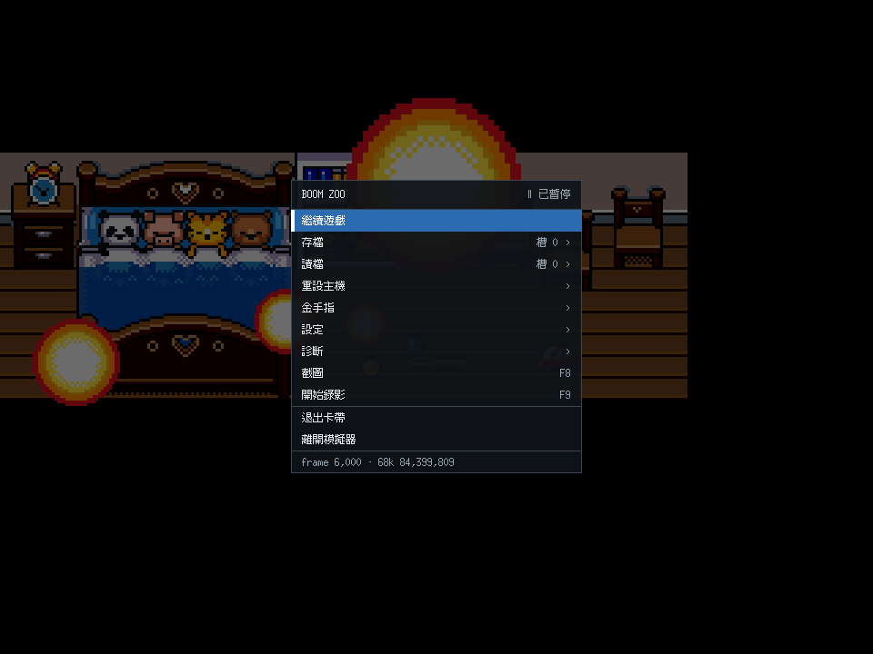 | 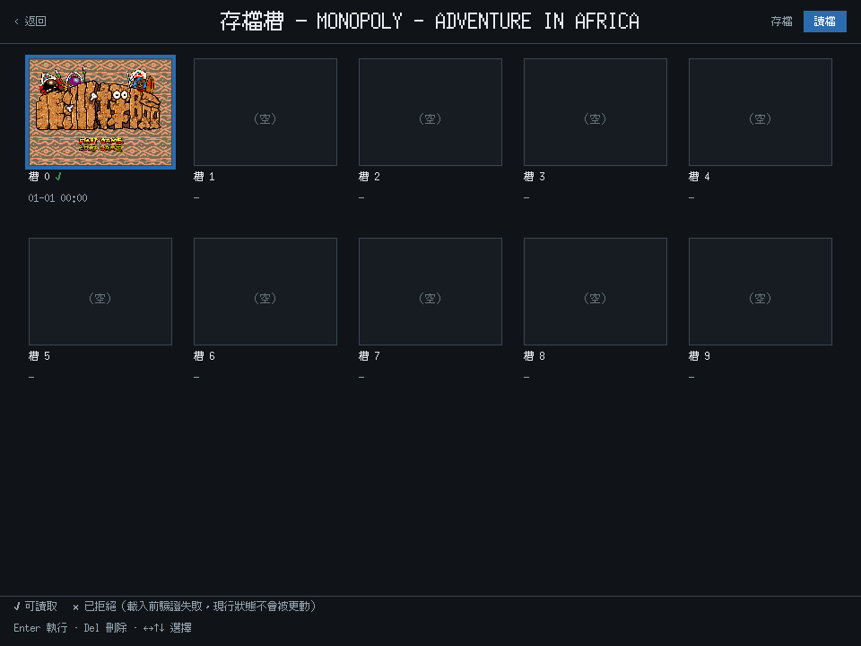 |

| 設定 | 診斷（`CGO_ENABLED=0` 建置） |
|---|---|
| 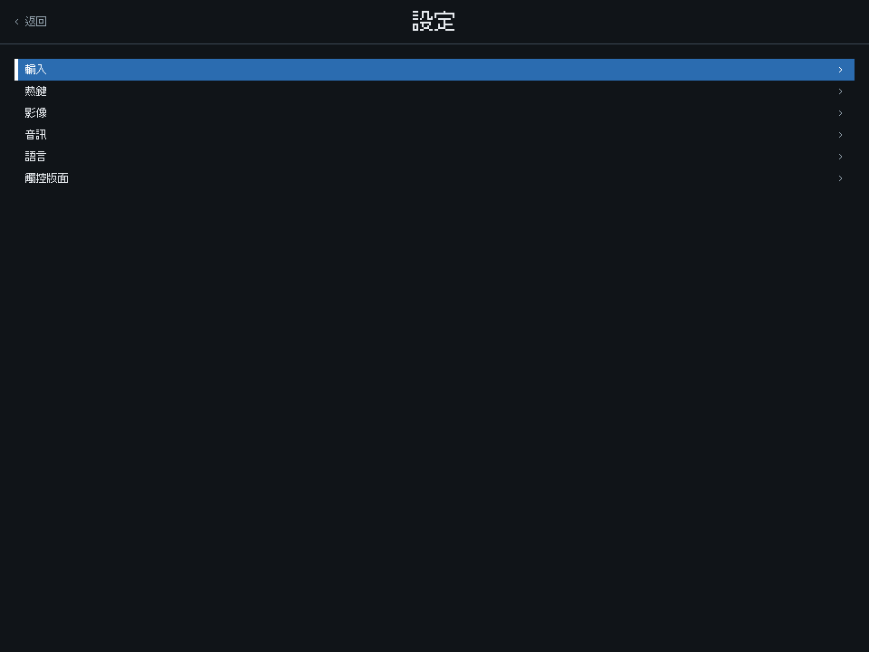 | 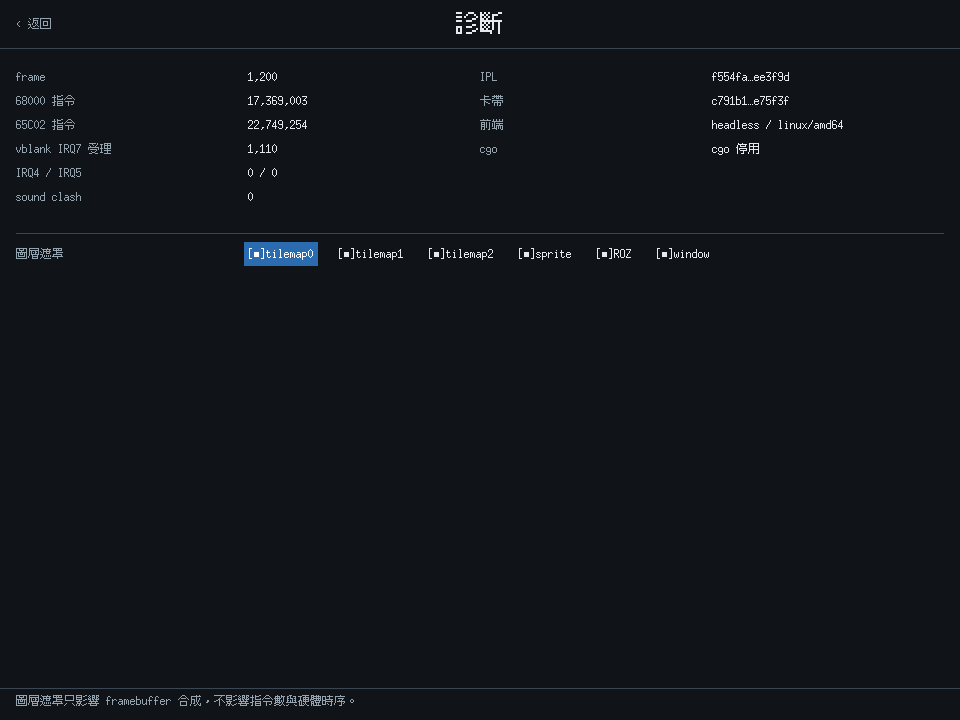 |

觸控版面把 4:3 畫面置中，方向鍵、四顆面鍵、L／R 與 Start／Select 分置兩側與下緣；
1280×720 橫向、預設 60% 不透明度：

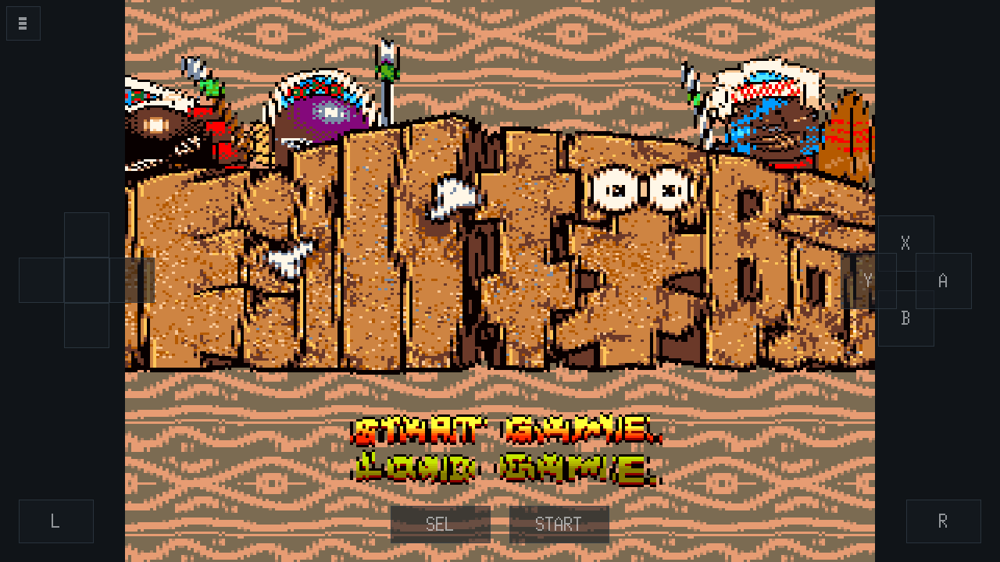

### 與 Bcan 的入口差異

Bcan 0.0.8b 是 Windows 程式，功能掛在視窗頂端的選單列上；本專案的介面全部自繪，
同一批功能改由覆蓋選單進入。

| Bcan 0.0.8b 的選單列（未載入卡帶） | 本專案的覆蓋選單 |
|---|---|
| 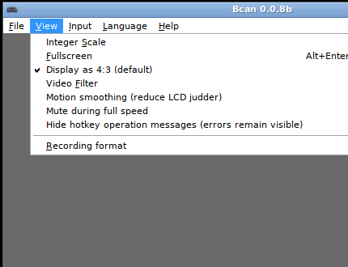 |  |

差別不只是外觀。選單列的入口本身看得見，覆蓋層沒有那個好處，所以載入卡帶後會在
左下角提示一次開選單的鍵（六秒後消失，開過選單就不再出現）。反過來，覆蓋選單在
三個平台是同一份版面，Android 也用得上；選單列在觸控裝置上沒有對應物。

功能逐項的對照——同等、改做法、延後、不做——見
[`docs/ui-design.md`](docs/ui-design.md) §4，Bcan 端的盤點見
[`docs/bcan-ui-inventory.md`](docs/bcan-ui-inventory.md)。

> Bcan 0.0.8b 的畫面版權屬其作者，此處僅作介面對照；截圖時未載入卡帶，
> 不含任何遊戲畫面。

## 遊戲截圖

> 截圖為各遊戲之版權畫面，僅供模擬器開發驗證，不作其他用途。

下列五張由發行的 AppImage 產生（`--screenshot` 直接取 UM6618 的顯示孔徑，
不套濾鏡也不含覆蓋層），重現命令見
[`docs/verify-rom-matrix.md`](docs/verify-rom-matrix.md)。

| Boom Zoo 標題（frame 3600） | Boom Zoo 角色選擇（frame 3600 按 A，frame 4200） |
|---|---|
| 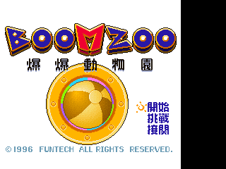 | 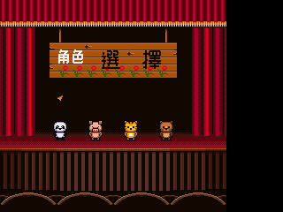 |

| Monopoly 標題（frame 3600） | Speedy Dragon 開場（frame 1200） |
|---|---|
| 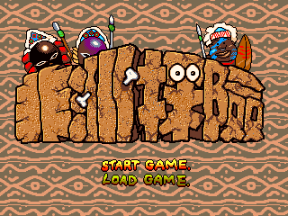 | 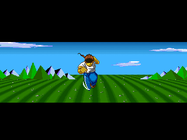 |

A'Can 開機 logo（frame 120）：

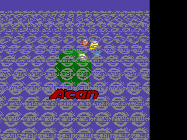

`docs/screenshots/` 底下未分類的舊檔是 deprecated C++ oracle 時期的畫面，由
[`docs/verify-audio-input.md`](docs/verify-audio-input.md) 與
[`docs/frame120-render-diff.md`](docs/frame120-render-diff.md) 當歷史證據引用，
不代表目前的 Go 核心輸出。

## 建置（Go 主線）

需求：Go 1.26.7、Ebitengine v2.9.9。GUI 與 headless 共用同一 machine core；Linux
桌面建置需要 X11／OpenGL／ALSA 開發套件，無實體顯示器時使用有界 Xvfb。

本儲存庫的開發、建置與測試一律在專案專用 Docker 工具鏈內進行；下列是容器內
命令，不應直接在主機執行。可由 `docker/ebitengine.Dockerfile` 建立固定工具映像。

```sh
go test ./...
```

deprecated C++ oracle 的歷史建置方式見
[`archive/cpp/README.md`](archive/cpp/README.md)，不是目前產品入口。

## 執行

Ebitengine 視窗入口：

```sh
go run ./cmd/acan \
    --ipl /path/to/internal_68k.bin \
    --key /path/to/umc6650.bin \
    --rom "/path/to/Boom Zoo (Taiwan).bin"
```

開發 smoke 可加 `--frames 300 --audio=false --screenshot /tmp/frame.png`，到指定的硬體
frame 後正常結束並輸出 framebuffer SHA-256。`--audio=false` 適用於沒有主機音效裝置
的 Docker／CI；這不是另一套快速模擬路徑。

Linux 桌面另有不需要 cgo 的入口，鍵位與上面相同，音訊交給外部播放程序：

```sh
CGO_ENABLED=0 go run ./cmd/acan-x11 \
    --ipl /path/to/internal_68k.bin \
    --key /path/to/umc6650.bin \
    --rom "/path/to/Boom Zoo (Taiwan).bin" \
    --audio-sink "aplay -f cd -t raw"
```

Go headless runner 已能載入外部、逐 word byte-swap 的 IPL／ROM 及線性 UMC6650 key：

```sh
go run ./cmd/acan-headless \
    --ipl /path/to/internal_68k.bin \
    --key /path/to/umc6650.bin \
    --rom "/path/to/Boom Zoo (Taiwan).bin" \
    --instructions 10000
```

需要定位晶片交易時，可加上例如
`--watch e80000-e9001f,f00000-f5ffff --watch-limit 64`；每筆 word 存取只記錄一次，
並附當下 68000 PC、opcode 與指令序號。

runner 會輸出 IPL／ROM SHA-256、PC、opcode、cycle、VRAM 與 framebuffer 指紋；遇到
尚未實作的 opcode 會明確失敗停止。以下較完整 CLI 仍屬 deprecated C++ oracle，移植前
不得視為 Go 介面承諾。

ROM 與 BIOS 為受版權保護檔案，**不包含**在本 repo；請自備 Bcan 的
`bios/supracan.zip`、`bios/umc6650.zip` 解壓後的檔案，以及卡帶 ROM。

```sh
# SDL2 視窗（預設）
./build/superacan-emu --bios /tmp/acan_bios \
    --rom "/path/to/Boom Zoo (Taiwan).bin"

# headless 驗證：跑 6000 幀後輸出 BMP 截圖
./build/superacan-emu --bios /tmp/acan_bios \
    --rom "/path/to/Boom Zoo (Taiwan).bin" \
    --headless --frames 6000 --screenshot /tmp/out.bmp

# 錄音 + 按鍵注入（里程碑 3/4）
./build/superacan-emu --bios /tmp/acan_bios \
    --rom "/path/to/Monopoly - Adventure in Africa (Taiwan).bin" \
    --headless --frames 4300 --wav /tmp/out.wav \
    --press 3700:START --screenshot /tmp/after.bmp
```

- `--bios <dir>`：內含 `internal_68k.bin`（4KB IPL）、`umc6650.bin`（16B 金鑰）；
  可選 `internal_6502_1/2.bin`（音訊取樣，開機複製進 sound RAM）
- `--rom <file>`：卡帶 ROM，raw binary 無標頭、16-bit word-swap 格式
  （載入時自動還原，見知識庫 `docs/bios-rom-format.md`）
- `--trace N`：以 Moira 反組譯器 log 前 N 條指令
- `--instructions N`：headless 且無 `--frames` 時，到卡帶入口後再執行的指令數
- `--headless` / `--frames N` / `--screenshot <file.bmp>`
- `--wav <file.wav>`：全程音訊錄成 48 kHz 16-bit stereo WAV
- `--press <spec>`：headless 按鍵注入 `frame:BTN+BTN,...`（按住 10 幀）；
  BTN = A/B/X/Y/L/R/START/SELECT/UP/DOWN/LEFT/RIGHT
- `--press2 <spec>`：以相同語法注入 P2
- `--save-state <file>` / `--load-state <file>`：寫入／載入本專案的 `ACANEST1`
  格式；不相容 Bcan save state，跨 ROM 使用目前仍在收緊
- 視窗模式鍵盤：方向鍵 + Z/X/A/S/Q/W = A/B/X/Y/L/R、Enter=Start、右 Shift=Select
- P2 鍵盤：I/J/K/L、U/O/N/M、逗號/句號、右 Ctrl、左 Shift
- 除錯環境變數：`ACAN_DEBUG`、`ACAN_DMA`、`ACAN_WATCH`、`ACAN_TRACE65`、
  `ACAN_DBG65`（65C02 暫存器定期 dump）、`ACAN_LAYERMASK`、
  `ACAN_DUMP=<prefix>`（見 `docs/verify-video.md`）

預期：通過 UMC6650 交握與授權比對後進入卡帶，vblank IRQ 驅動遊戲主迴圈，
畫面經 SDL2 顯示（Boom Zoo 可見標題「爆爆動物園」）。

## 下載

| 平台 | 檔案 |
|---|---|
| Linux x86_64 | [`SuperACan-x86_64.AppImage`](https://github.com/wicanr2/superacan-emu/releases/download/v0.1.0-preview/SuperACan-x86_64.AppImage) |
| macOS 12+（arm64 ＋ x86_64） | [`SuperACan-macOS-universal.app.zip`](https://github.com/wicanr2/superacan-emu/releases/download/v0.1.0-preview/SuperACan-macOS-universal.app.zip) |
| Android 5.0+（arm64／armv7／x86_64） | [`superacan-emu.apk`](https://github.com/wicanr2/superacan-emu/releases/download/v0.1.0-preview/superacan-emu.apk) |
| 雜湊 | [`SHA256SUMS.txt`](https://github.com/wicanr2/superacan-emu/releases/download/v0.1.0-preview/SHA256SUMS.txt) |

macOS 版未簽章，第一次開啟要「右鍵 → 打開」。APK 由發行金鑰簽章，憑證指紋列在
[Release 說明](https://github.com/wicanr2/superacan-emu/releases/tag/v0.1.0-preview)，
可用 `apksigner verify --print-certs` 核對。**發行包不含 ROM 與 BIOS**，
執行需要使用者自備。

## 發行包（Linux）

Linux 的發行形式是 AppImage：單一檔案、不需要安裝、不依賴發行版的套件庫，裡面是
`CGO_ENABLED=0` 的純 Go 執行檔。沒有給旗標時韌體與卡帶的預設位置是：

```
~/.local/share/superacan-emu/firmware/    internal_68k.bin、umc6650.bin、internal_6502_1.bin、internal_6502_2.bin
~/.local/share/superacan-emu/cartridges/  卡帶
```

缺韌體或缺卡帶不是啟動失敗——啟動畫面會列出四份韌體各自的狀態與雜湊。
ROM 與 BIOS 不隨發行包散布。建置方式與展示影片的錄製流程見
[`docs/release-packaging.md`](docs/release-packaging.md)。

## 發行包（macOS、Android）

macOS 是 universal `.app`（arm64 + x86_64），Android 是三個 ABI 的 APK。兩者都在
容器內交叉編出來，建置方式、靜態驗收結果與踩過的坑見
[`docs/release-packaging.md`](docs/release-packaging.md)。

**兩個包都沒有在實機上跑過**：macOS 的 `.app` 未簽章（`codesign` 只在 macOS 上有），
Android 的 APK 用除錯金鑰簽只夠側載。靜態驗收全過只代表不會因為結構問題開不起來。

## 熱鍵

X11 與 macOS 前端的出廠鍵位。十七個動作都可以在設定 → 熱鍵（S5.2）重新指定；
沒有列出的四個動作預設不綁鍵，要自己指定。

| 鍵 | 動作 | 鍵 | 動作 |
|---|---|---|---|
| F1 | 開啟選單 | F8 | 截圖 |
| F2 | 暫停／繼續 | F9 | 開始／停止錄影 |
| F3 | 重設主機（軟） | F10 | 顯示／隱藏 FPS |
| F4 | 靜音 | F11 | 全螢幕（設定已切換，視窗層尚未套用） |
| F5 | 存檔到目前槽 | F12 | 載入卡帶 |
| F6 | 下一個存檔槽 | Tab | 全速（按住） |
| F7 | 從目前槽讀檔 | | |

`--state` 給了單檔存讀路徑時，F5／F7 維持舊行為，兩個槽位熱鍵讓開。
驗證方式與 headless 的重現命令見 [`docs/verify-ui.md`](docs/verify-ui.md)。

## 文件

- [`AGENTS.md`](AGENTS.md)：晶片模擬、證據、測試與 Docker 開發規範
- [`CONTEXT.md`](CONTEXT.md)：目前真相、證據邊界與下一個交付閘門
- [`WORKLIST.md`](WORKLIST.md)：唯一可執行待辦
- [`WORKLOG.md`](WORKLOG.md)：逐輪工作歷程
- [`docs/chip-emulation-principles.md`](docs/chip-emulation-principles.md)：CPU、bus phase、
  DMA、IRQ、scheduler、save state 與 Ebitengine 邊界通則
- [`docs/m68k-implementation.md`](docs/m68k-implementation.md)：68000 ISA／timing 來源、
  已實作 vertical slice 與證據限制
- [`docs/m65c02-implementation.md`](docs/m65c02-implementation.md)：W65C02 reset、3:1
  排程、sound boot 路徑與尚未完成的 ISA／IRQ
- [`docs/umc6618-implementation.md`](docs/umc6618-implementation.md)：視訊 register、
  palette、VRAM、scanline 與真實卡帶交易證據
- [`docs/ebitengine-frontend.md`](docs/ebitengine-frontend.md)：GUI／machine deadline 邊界、
  依賴版本、88-frame smoke 與目前畫面限制
- [`docs/bcan-oracle-diff.md`](docs/bcan-oracle-diff.md)：Bcan 0.0.8b 畫面 oracle 管線、
  可比與不可比的部分、5 位元調色盤展開的證據
- [`docs/cpu-generic-execution.md`](docs/cpu-generic-execution.md)：68000／65C02 一般化
  執行層的結構、時間模型與已定案的勘誤
- [`docs/x11-frontend.md`](docs/x11-frontend.md)：純 Go X11 前端的契約、驗證與限制
- [`docs/save-state.md`](docs/save-state.md)：存檔版面、交易式載入契約與涵蓋範圍
- [`docs/ui-design.md`](docs/ui-design.md)：使用者介面設計——Bcan 功能對照、畫面線框、
  三平台差異化、互動模型、文案與分階段驗收條件
- [`docs/bcan-ui-inventory.md`](docs/bcan-ui-inventory.md)：Bcan 0.0.8b 的介面功能盤點
- [`docs/ui-font.md`](docs/ui-font.md)：介面字型涵蓋範圍與散布授權查核
- [`docs/platform-targets.md`](docs/platform-targets.md)：三個發行平台的建置矩陣與 cgo 邊界
- [`docs/capture-formats.md`](docs/capture-formats.md)：截圖與錄影在純 Go 下的可行格式
- [`docs/verify-ui.md`](docs/verify-ui.md)：介面畫面雜湊、headless 覆蓋層驗證與卡帶基準
- [`docs/macos-frontend.md`](docs/macos-frontend.md)：macOS 的 purego 視窗層與實機 smoke 步驟
- [`docs/android-frontend.md`](docs/android-frontend.md)：Android 的兩層切法、cgo 量測、
  表面尺寸政策、生命週期與返回鍵語意、工具鏈需求
- [`docs/release-packaging.md`](docs/release-packaging.md)：AppImage 的組法與驗證、
  展示影片的錄製管線（合成錄影、音訊補齊、為什麼用讀檔）
- [`docs/verify-rom-matrix.md`](docs/verify-rom-matrix.md)：八款商業 ROM 的執行與畫面矩陣
- [`archive/cpp/README.md`](archive/cpp/README.md)：deprecated C++ oracle 的用途與重建方式
- [`docs/verify-ipl.md`](docs/verify-ipl.md)、[`docs/verify-video.md`](docs/verify-video.md)、
  [`docs/verify-audio-input.md`](docs/verify-audio-input.md)、[`docs/verify-misc.md`](docs/verify-misc.md)：
  各里程碑的可重現證據與限制

## Deprecated C++ oracle 的第三方元件（固定）

下列元件只存在於 `archive/cpp/`，純 Go production 不連結或包裝它們。

| 元件 | 用途 | 版本（commit） | 授權 |
|---|---|---|---|
| [Moira](https://github.com/dirkwhoffmann/Moira) | 68k CPU 核心 | `a4c273b` | MIT |
| [CLK](https://github.com/TomHarte/CLK)（`Processors/6502Mk2`） | WDC 65C02 核心 | `096de57` | MIT |
| [SDL2](https://github.com/libsdl-org/SDL) | 視窗/畫面輸出 | 2.30.0（系統或 FetchContent） | zlib |

MAME `supracan.cpp`（BSD-3-Clause，Angelo Salese / Ryan Holtz 等）：UM6618
渲染、DMA、中斷行為以其為參考**重新實作**（`src/video/um6618.cpp`、
`src/bus.cpp` 標頭註明出處），未複製程式碼。
MAME `umc6619_sound.cpp`（BSD-3-Clause，Ryan Holtz / superctr）：UM6619
PCM 合成模型（通道/period/音量/key/DMA/timer 暫存器語意與混音流程）以其為
參考**重新實作**（`src/audio/um6619.*` 標頭註明出處），未複製程式碼。

## 版權注意

- ROM、BIOS（`internal_68k.bin`、`internal_6502_*.bin`、`umc6650.bin`）皆為
  UMC/Funtech 受版權保護內容，本 repo 不收錄；`.gitignore` 已排除
  `*.bin`/`*.zip`/`ROMS/`/`bios/`。
- `docs/screenshots/` 內的截圖與 Release 附件的展示影片為遊戲執行畫面
  （遊戲內容仍屬原廠商版權），**僅供開發驗證與功能展示用途**，請勿另作散布。
- `docs/screenshots/bcan/` 是 Bcan 0.0.8b 的介面截圖，版權屬其作者，
  僅作介面對照；截圖時未載入卡帶，不含遊戲畫面。
- 硬體規格結論引自知識庫 `acan/docs/`（對 Bcan 0.0.8b 的逆向分析）。

## 授權

本專案自有程式碼以 **RRSAL-1.0**（復古重製 source-available 授權條款 1.0，
SPDX `LicenseRef-RRSAL-1.0`）釋出，全文見 [`LICENSE`](LICENSE)。重點：

- **非商業用途免費**：個人、教育、研究、保存、評論都可以自由使用、修改與再散布，
  只要標示出處、保留授權全文，並且不對取得本作品本身收費。
- **實況、錄影、直播、教學、論文引用不算商業使用**，平台廣告分潤與觀眾贊助
  同樣不受限（第 4 條明列）。
- **商業使用需要事先書面授權**，請寄 wicanr2@gmail.com 洽談。
- **不得散布 ROM／BIOS，也不得把它們和本作品打包在一起**（第 5 條 (e)）。

這不是 OSI 定義的開源授權（有非商業限制），對外請寫 source-available。
第三方元件依其各自授權，發行包內的 `THIRD-PARTY-LICENSES` 列出完整清單；
`archive/cpp/` 的 Moira 與 CLK 為 MIT，SDL2 為 zlib。

`v0.1.0-preview` 發行包附的是 MIT，該授權對已散布的那些副本持續有效；
RRSAL-1.0 適用於此後散布的副本。
