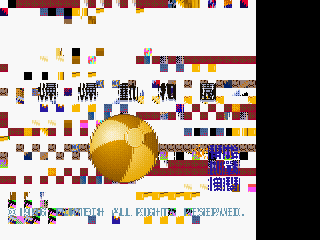
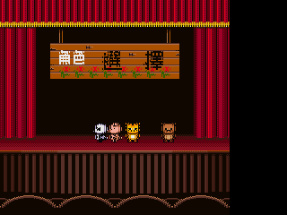
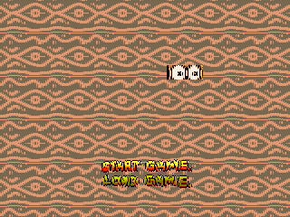
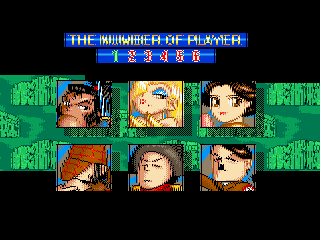
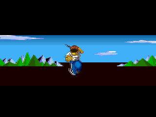
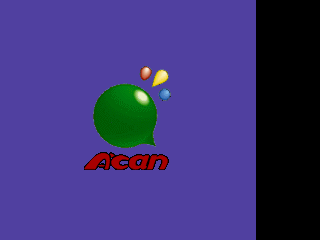

# superacan-emu

Super A'Can（敦煌科技 Funtech，1995，台灣自製 16 位元遊戲機）的開源硬體模擬器。
production 主線正改以純 Go 重寫 68000／65C02、UMC6650、UM6618、UM6619、DMA、
輸入與整機時間線，Ebitengine 將負責跨平台前端；遊戲只用來驗證晶片行為，這不是
遊戲 remake。

Bcan 0.0.8b 是閉源 Windows 模擬器且沒有公開移植。本專案依據唯讀知識庫
[superacan](https://github.com/wicanr2/superacan) 的 Bcan／BIOS 逆向證據，以及 MAME
driver（BSD-3-Clause）的硬體行為參考，建立獨立、可攜的純 Go 實作。

長期目標：以可追溯、可重現的晶片模型在 Linux 執行 Super A'Can 軟體，並在核心
收斂後提供 macOS 版本。模擬器原始碼同時是硬體文件；相容性不能取代硬體證據。

## 目前進度（純 Go 轉向）

2026-08-31 已決定停止 C++ production path。現有可執行 C++ 里程碑將保存在同 repo
的 `archive/cpp/`，標為 deprecated reference implementation，作 Go 差分 oracle，
不再新增功能。Go 68000 核心採獨立實作；Moira 只作 sample，不直接翻譯。

Go 主線目前已有 media manifest、整機 bus、UMC6650、phase timeline、headless runner，
並以固定 IPL SHA-256 完成真實 Boom Zoo IPL、UMC6650、卡帶授權與 overlay 轉交；
目前已用純 Go W65C02 完成 Boom Zoo sound driver boot ack；UM6618 register、palette、
VRAM、scanline timing 與第一版 tilemap／sprite／window／ROZ framebuffer 已接入，卡帶
可自然離開 vblank poll，並產生可重現的非黑畫面指紋。headless runner 可輸出有界 bus
transaction、IRQ acknowledge 計數、VRAM 與 framebuffer hash。UM6618 IRQ7 已在真實
路徑受理；ROZ 逐行表已有 MAME-derived 實作。尚未完成完整 CPU ISA／一般 exception、
同 frame 畫面差分及 UMC6619 PCM。
下列完整相容性仍是
deprecated C++ oracle 的舊里程碑，不是 Go 版完成度：

- [x] 68k（Moira）+ 匯流排記憶體映射（依知識庫 `docs/memory-map.md` §2 (a) 級定案）
- [x] UMC6650 lockout 晶片完整實作（埠角色以 IPL 反組譯為準，見
      `docs/bios-68k.md` §3；**MAME `umc6650.cpp` 的埠角色寫反，本實作不沿用**）
- [x] 68k IPL overlay（`$E9001C` bit1/bit3，**單向 latch**，見 `docs/verify-video.md`）
- [x] UM6618 繪圖：3 tilemap 層（8/4/2bpp、scroll/mosaic/linescroll/lineselect/
      優先度混色）+ sprite（含 mask 模式）+ window 0 + sprite DMA；ROZ 暫 stub
- [x] 68k IRQ：vblank（IRQ7）、raster（IRQ4）、line on/off（IRQ5）、
      65C02 mailbox（IRQ6），HOLD_LINE 語意以 Moira `willInterrupt` 模擬
- [x] 主機 DMA 2 通道（byte/word/0xA800 填充/間接模式）
- [x] 65C02（CLK `6502Mk2`）實際執行：I/O `$0400-$04FF`、命令 mailbox、
      boot ack、HALT/釋放（重新上傳驅動；reset 拉住至向量讀取完成）
- [x] **UM6619 音效合成**：16 通道 PCM 取樣（period/音量/key/長度/起始位址）、
      DMA 雙緩衝（IRQ bit6）、內建 timer（IRQ bit7，音樂 tempo）；
      原生 44744 Hz → 線性插值 48000 Hz；SDL2 音訊輸出 + `--wav` headless 錄音
      （`src/audio/um6619.*`，見 `docs/verify-audio-input.md`）
- [x] 65C02 IRQ 來源模型：level-held + 專屬 ack（`$0411` 純狀態）；latch
      `$0404/$0405`（空=`$CD`、68k 寫入觸發 IRQ）
- [x] 手把輸入：SDL 鍵盤（方向鍵 + Z/X/A/S/Q/W = A/B/X/Y/L/R、Enter=Start、
      右 Shift=Select；P1）+ headless `--press frame:BTN,...` 注入；
      65C02 shift register 掃描與 68k direct mode 兩路皆通
- [x] SDL2 視窗輸出 + headless 驗證模式（`--frames`/`--screenshot`/`--wav`/`--press`）
- [x] 遊戲驗證：Boom Zoo、Monopoly（畫面+音樂+按鍵反應）、Speedy Dragon
      （**第二套音樂驅動已修復**，預設模式可跑；見 `docs/verify-audio-input.md`）
- [x] ROZ、P2 輸入與自訂 save state 初版；sprite DMA word 雙觸發已修正
      （見 `docs/verify-misc.md`）
- [ ] 里程碑 5 尚待乾淨 Docker 建置與跨遊戲回歸；FRC 真實公式、UM6619 envelope、
      latch 3-byte 用途與 window 1 仍未取得硬體級證據

詳細現況以 [`CONTEXT.md`](CONTEXT.md) 為準，可執行待辦只看
[`WORKLIST.md`](WORKLIST.md)。

## 遊戲截圖（開發驗證用途）

> 截圖為各遊戲之版權畫面，僅供模擬器開發驗證，不作其他用途。

| Boom Zoo 標題 | Boom Zoo 角色選擇（按鍵驗證） |
|---|---|
|  |  |

| Monopoly 標題 | Monopoly 玩家人數選擇（按鍵驗證） |
|---|---|
|  |  |

| Speedy Dragon 開頭場景 | A'Can 開機 logo |
|---|---|
|  |  |

## 建置（Go 主線）

需求：Go 1.26。Ebitengine 尚未接入目前 headless machine core；加入前會固定
module 版本與跨平台工具鏈。

本儲存庫的開發、建置與測試一律在專案專用 Docker 工具鏈內進行；下列是容器內
命令，不應直接在主機執行。目前正在建立專案專用的固定 Go image。

```sh
go test ./...
```

deprecated C++ oracle 的歷史建置方式見
[`archive/cpp/README.md`](archive/cpp/README.md)，不是目前產品入口。

## 執行

Go headless runner 已能載入外部、逐 word byte-swap 的 IPL／ROM 及線性 UMC6650 key：

```sh
go run ./cmd/acan-headless \
    --ipl /path/to/internal_68k.bin \
    --key /path/to/umc6650.bin \
    --rom "/path/to/Boom Zoo (Taiwan).bin" \
    --instructions 10000
```

需要定位晶片交易時，可加上例如
`--watch e80000-e9001f,f00000-f5ffff --watch-limit 64`；每筆 word 存取只記錄一次，
並附當下 68000 PC、opcode 與指令序號。

runner 會輸出 IPL／ROM SHA-256、PC、opcode、cycle、VRAM 與 framebuffer 指紋；遇到
尚未實作的 opcode 會明確失敗停止。以下較完整 CLI 仍屬 deprecated C++ oracle，移植前
不得視為 Go 介面承諾。

ROM 與 BIOS 為受版權保護檔案，**不包含**在本 repo；請自備 Bcan 的
`bios/supracan.zip`、`bios/umc6650.zip` 解壓後的檔案，以及卡帶 ROM。

```sh
# SDL2 視窗（預設）
./build/superacan-emu --bios /tmp/acan_bios \
    --rom "/path/to/Boom Zoo (Taiwan).bin"

# headless 驗證：跑 6000 幀後輸出 BMP 截圖
./build/superacan-emu --bios /tmp/acan_bios \
    --rom "/path/to/Boom Zoo (Taiwan).bin" \
    --headless --frames 6000 --screenshot /tmp/out.bmp

# 錄音 + 按鍵注入（里程碑 3/4）
./build/superacan-emu --bios /tmp/acan_bios \
    --rom "/path/to/Monopoly - Adventure in Africa (Taiwan).bin" \
    --headless --frames 4300 --wav /tmp/out.wav \
    --press 3700:START --screenshot /tmp/after.bmp
```

- `--bios <dir>`：內含 `internal_68k.bin`（4KB IPL）、`umc6650.bin`（16B 金鑰）；
  可選 `internal_6502_1/2.bin`（音訊取樣，開機複製進 sound RAM）
- `--rom <file>`：卡帶 ROM，raw binary 無標頭、16-bit word-swap 格式
  （載入時自動還原，見知識庫 `docs/bios-rom-format.md`）
- `--trace N`：以 Moira 反組譯器 log 前 N 條指令
- `--instructions N`：headless 且無 `--frames` 時，到卡帶入口後再執行的指令數
- `--headless` / `--frames N` / `--screenshot <file.bmp>`
- `--wav <file.wav>`：全程音訊錄成 48 kHz 16-bit stereo WAV
- `--press <spec>`：headless 按鍵注入 `frame:BTN+BTN,...`（按住 10 幀）；
  BTN = A/B/X/Y/L/R/START/SELECT/UP/DOWN/LEFT/RIGHT
- `--press2 <spec>`：以相同語法注入 P2
- `--save-state <file>` / `--load-state <file>`：寫入／載入本專案的 `ACANEST1`
  格式；不相容 Bcan save state，跨 ROM 使用目前仍在收緊
- 視窗模式鍵盤：方向鍵 + Z/X/A/S/Q/W = A/B/X/Y/L/R、Enter=Start、右 Shift=Select
- P2 鍵盤：I/J/K/L、U/O/N/M、逗號/句號、右 Ctrl、左 Shift；F5 存檔、F6 切槽、F7 讀檔
- 除錯環境變數：`ACAN_DEBUG`、`ACAN_DMA`、`ACAN_WATCH`、`ACAN_TRACE65`、
  `ACAN_DBG65`（65C02 暫存器定期 dump）、`ACAN_LAYERMASK`、
  `ACAN_DUMP=<prefix>`（見 `docs/verify-video.md`）

預期：通過 UMC6650 交握與授權比對後進入卡帶，vblank IRQ 驅動遊戲主迴圈，
畫面經 SDL2 顯示（Boom Zoo 可見標題「爆爆動物園」）。

## 文件

- [`AGENTS.md`](AGENTS.md)：晶片模擬、證據、測試與 Docker 開發規範
- [`CONTEXT.md`](CONTEXT.md)：目前真相、證據邊界與下一個交付閘門
- [`WORKLIST.md`](WORKLIST.md)：唯一可執行待辦
- [`WORKLOG.md`](WORKLOG.md)：逐輪工作歷程
- [`docs/chip-emulation-principles.md`](docs/chip-emulation-principles.md)：CPU、bus phase、
  DMA、IRQ、scheduler、save state 與 Ebitengine 邊界通則
- [`docs/m68k-implementation.md`](docs/m68k-implementation.md)：68000 ISA／timing 來源、
  已實作 vertical slice 與證據限制
- [`docs/m65c02-implementation.md`](docs/m65c02-implementation.md)：W65C02 reset、3:1
  排程、sound boot 路徑與尚未完成的 ISA／IRQ
- [`docs/umc6618-implementation.md`](docs/umc6618-implementation.md)：視訊 register、
  palette、VRAM、scanline 與真實卡帶交易證據
- [`archive/cpp/README.md`](archive/cpp/README.md)：deprecated C++ oracle 的用途與重建方式
- [`docs/verify-ipl.md`](docs/verify-ipl.md)、[`docs/verify-video.md`](docs/verify-video.md)、
  [`docs/verify-audio-input.md`](docs/verify-audio-input.md)、[`docs/verify-misc.md`](docs/verify-misc.md)：
  各里程碑的可重現證據與限制

## Deprecated C++ oracle 的第三方元件（固定）

下列元件只存在於 `archive/cpp/`，純 Go production 不連結或包裝它們。

| 元件 | 用途 | 版本（commit） | 授權 |
|---|---|---|---|
| [Moira](https://github.com/dirkwhoffmann/Moira) | 68k CPU 核心 | `a4c273b` | MIT |
| [CLK](https://github.com/TomHarte/CLK)（`Processors/6502Mk2`） | WDC 65C02 核心 | `096de57` | MIT |
| [SDL2](https://github.com/libsdl-org/SDL) | 視窗/畫面輸出 | 2.30.0（系統或 FetchContent） | zlib |

MAME `supracan.cpp`（BSD-3-Clause，Angelo Salese / Ryan Holtz 等）：UM6618
渲染、DMA、中斷行為以其為參考**重新實作**（`src/video/um6618.cpp`、
`src/bus.cpp` 標頭註明出處），未複製程式碼。
MAME `umc6619_sound.cpp`（BSD-3-Clause，Ryan Holtz / superctr）：UM6619
PCM 合成模型（通道/period/音量/key/DMA/timer 暫存器語意與混音流程）以其為
參考**重新實作**（`src/audio/um6619.*` 標頭註明出處），未複製程式碼。

## 版權注意

- ROM、BIOS（`internal_68k.bin`、`internal_6502_*.bin`、`umc6650.bin`）皆為
  UMC/Funtech 受版權保護內容，本 repo 不收錄；`.gitignore` 已排除
  `*.bin`/`*.zip`/`ROMS/`/`bios/`。
- `docs/screenshots/` 內的截圖為遊戲執行畫面（遊戲內容仍屬原廠商版權），
  **僅供開發驗證用途**，請勿另作散布。
- 硬體規格結論引自知識庫 `acan/docs/`（對 Bcan 0.0.8b 的逆向分析）。

## 授權

本專案自有程式碼以 MIT 授權釋出（見 `LICENSE`）。第三方元件依其各自授權
（Moira、CLK 皆為 MIT）。
